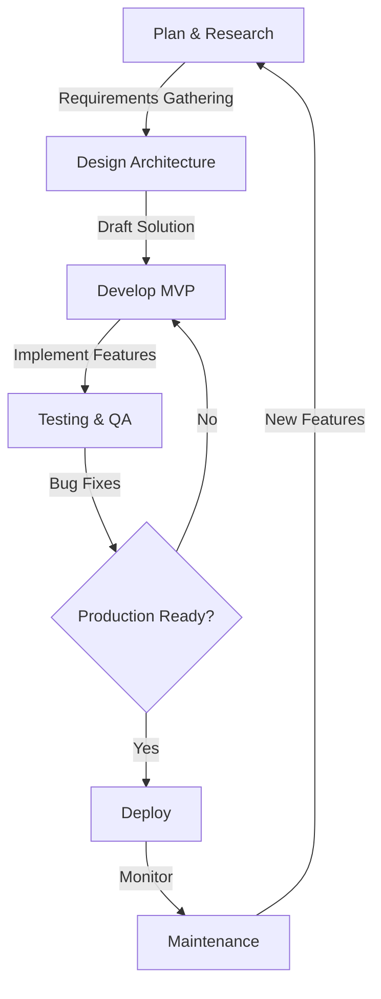

# Sanskar Pandey

<div align="center">
  <h3>Full Stack Developer & AI Enthusiast</h3>
  
  
  
  
   

</div>

<div align="center">
  <h4><i>Transforming complexity into scalable innovation with robust Software development and agile methodologies.</i></h4>
</div>

<div align="center">
  
  [](https://linkedin.com/in/sanskarpandey2004) 
  [](https://x.com/sanskarpan) 
  [](mailto:sanskar.works.2004@gmail.com)
  <!-- [](https://www.leetcode.com/sanskarpandey2004) -->
  
</div>

---

## 💫 Professional Summary

```typescript
const sanskarPandey = {
  title: "Full Stack & AI Developer",
  specialisation: ["Web Development", "DevOps", "AI & ML"],
  currentProjects: [
    "Financial tracking website with PostgreSQL (Neon) and visualisations",
    "PDF-to-XML converter using NextJS & NestJS"
  ],
  lookingToCollaborateOn: [
    "Open-source projects related to AI, DevOps, or backend development",
    "LangChain & RAG implementations for AI-powered assistants",
    "Deep Learning Projects"
  ],
  funFact: "I'm doing multiple degrees while also building full-stack and AI native projects 🚀"
};
```

I'm a dedicated Full Stack Developer specializing in web applications with a focus on AI integration. Passionate about building scalable, efficient solutions with modern technologies. Currently balancing academic pursuits with hands-on project development and open source contributions.

---

## 🌐 Current Focus

<div align="center">
  <table>
    <tr>
      <td align="center"></td>
      <td><b>Full Stack Development</b>: Building robust web applications with modern frameworks</td>
    </tr>
    <tr>
      <td align="center"></td>
      <td><b>DevOps</b>: Implementing CI/CD pipelines and container orchestration</td>
    </tr>
    <tr>
      <td align="center"></td>
      <td><b>AI & ML</b>: Developing machine learning models and AI-powered applications</td>
    </tr>
    <tr>
      <td align="center"></td>
      <td><b>Open Source</b>: Contributing to meaningful open source projects</td>
    </tr>
  </table>
</div>

---

## 💻 Technical Expertise

<table>
  <tr>
    <td valign="top" width="50%">
      <h3>Languages</h3>
      
      
      
      
      
      
      
      
    </td>
    <td valign="top" width="50%">
      <h3>Frontend Development</h3>
      
      
      
      
      
      
      
      
    </td>
  </tr>
  <tr>
    <td valign="top" width="50%">
      <h3>Backend Development</h3>
      
      
      
      
      
      
      
      
    </td>
    <td valign="top" width="50%">
      <h3>Database & Cloud</h3>
      
      
      
      
      
      
      
      
    </td>
  </tr>
  <tr>
    <td valign="top" width="50%">
      <h3>DevOps & Tools</h3>
      
      
      
      
      
      
    </td>
    <td valign="top" width="50%">
      <h3>AI & ML</h3>
      
      
      
      
      
      
      
      
    </td>
  </tr>
</table>

---

## 📊 GitHub Statistics

<div align="center">
  <table>
    <tr>
      <td>
        
      </td>
      <td>
        
      </td>
    </tr>
  </table>
  
  
</div>

## 🏆 GitHub Trophies
<div align="center">
  
</div>

## Contribution Graph
<div align="center">
  <picture>
    <source media="(prefers-color-scheme: dark)" srcset="https://github-readme-activity-graph.vercel.app/graph?username=sanskarpan&theme=react-dark&hide_border=true&area=true" />
    <source media="(prefers-color-scheme: light)" srcset="https://github-readme-activity-graph.vercel.app/graph?username=sanskarpan&theme=minimal&hide_border=true&area=true" />
    
  </picture>
</div>

## 💼 Professional Experience

I specialize in developing **enterprise-grade web applications** with a focus on **scalability, performance, and DevOps integration**. My experience includes:

- **Backend Development:**  
  - Designing and implementing **RESTful APIs** and **microservices** 
  - Ensuring **high performance, security, and scalability** in web applications  
  - **Optimizing database queries** and **caching strategies** to enhance performance  

- **Frontend Development:**  
  - Developing **dynamic, accessible, and responsive UIs** 
  - Implementing **state management solutions** and integrating **API-based data fetching**  

- **Cloud & DevOps:**  
  - **Deploying applications** with optimized configurations  
  - Setting up **CI/CD pipelines** using **GitHub Actions** and **Docker**  
  - Managing **server configurations** with **Nginx, Kubernetes, and container orchestration**  

- **AI & Data Engineering:**  
  - Implementing **NLP-based AI workflows** using **LangChain, FAISS, and LLMs**  
  - **Building intelligent systems** with **Distributed CLoud based Microservices**  
  - Performing **data processing and analysis** using **Pandas, Matplotlib, and Scikit-learn**  

I thrive on **solving complex problems, optimizing workflows, and contributing to open-source projects.** 🚀


## 🌟 Development Workflow



## 🔝 Top Contributed Repositories
<div align="center">
  
</div>

## 💡 Random Dev Quote
<div align="center">
  
</div>

---

## 📫 Let's Connect

<div align="center">
  <a href="https://linkedin.com/in/sanskarpandey2004">
    
  </a>
  <a href="https://x.com/sanskarpan">
    
  </a>
  <a href="https://www.leetcode.com/sanskarpandey2004">
    
  </a>
  <a href="mailto:sanskar.works.2004@gmail.com">
    
  </a>
</div>

<div align="center">
  <h4>Let's collaborate on something innovative! 🚀</h4>

</div>
