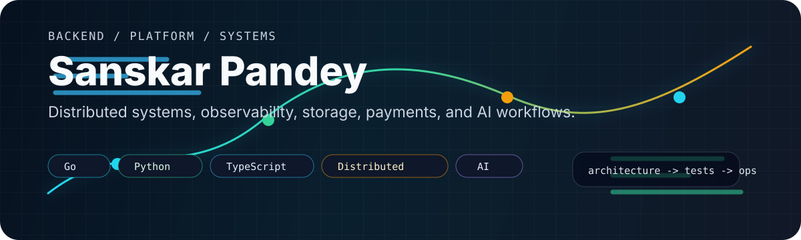

<div align="center">



<br />
<br />

I build infrastructure-heavy products across Go, Python, TypeScript, distributed systems, observability, storage, payments, and AI-assisted workflows.

[](https://linkedin.com/in/sanskarpandey2004)
[](https://x.com/sanskarpan)
[](mailto:sanskar.works.2004@gmail.com)

</div>

---

## Engineering Thesis

I am building toward the kind of engineering work where product decisions, architecture, implementation, reliability, and operations are connected.

The strongest projects here are systems-oriented: payment flows with explicit state machines, tracing pipelines with sampling and metrics, storage and concurrency primitives, reliable webhook delivery, and AI products backed by real infrastructure.

```text
design the invariants -> build the system -> prove it with tests -> document how it fails
```

---

## Flagship Work

<table>
  <tr>
    <td width="50%">
      <h3><a href="https://github.com/sanskarpan/Latexy">Latexy</a></h3>
      <p>AI-powered LaTeX resume builder with FastAPI, Next.js, WebSockets, Celery, Redis, PostgreSQL, MinIO, pgvector, BYOK, billing controls, and ATS analysis.</p>
      <p>
        
        
        
        
      </p>
    </td>
    <td width="50%">
      <h3><a href="https://github.com/sanskarpan/PayGate">PayGate</a></h3>
      <p>Payment platform design around state machines, double-entry ledgering, transactional outbox, saga orchestration, settlements, reconciliation, and webhooks.</p>
      <p>
        
        
        
        
      </p>
    </td>
  </tr>
  <tr>
    <td width="50%">
      <h3><a href="https://github.com/sanskarpan/http-server">http-server</a></h3>
      <p>Go HTTP/1.1 server with custom parser, router, response writer, static file serving, WebSocket support, fuzzing, soak baselines, and race testing.</p>
      <p>
        
        
        
        
      </p>
    </td>
    <td width="50%">
      <h3><a href="https://github.com/sanskarpan/distributed-tracing-system">distributed-tracing-system</a></h3>
      <p>Go collector and React UI for trace ingestion, sampling, RED metrics, service maps, trace comparison, SSE updates, load tests, Kubernetes, and Helm.</p>
      <p>
        
        
        
        
      </p>
    </td>
  </tr>
</table>

| Project | What it demonstrates |
|---|---|
| [Latexy](https://github.com/sanskarpan/Latexy) | Full-stack AI product with FastAPI, Next.js, WebSockets, Celery, Redis, PostgreSQL, MinIO, pgvector, BYOK, billing controls, ATS analysis, and operational setup. |
| [PayGate](https://github.com/sanskarpan/PayGate) | Payment platform design around state machines, double-entry ledgering, transactional outbox, saga orchestration, settlements, reconciliation, webhooks, and operator workflows. |
| [http-server](https://github.com/sanskarpan/http-server) | Go HTTP/1.1 server with custom parser, router, response writer, static file serving, WebSocket support, fuzz/soak/benchmark validation, race testing, and release docs. |
| [distributed-tracing-system](https://github.com/sanskarpan/distributed-tracing-system) | Go collector and React UI for trace ingestion, sampling, RED metrics, service maps, trace comparison, SSE updates, load tests, Kubernetes manifests, and Helm packaging. |
| [Webhook](https://github.com/sanskarpan/Webhook) | Reliable webhook delivery with FastAPI, PostgreSQL, Redis, Celery, retries, delivery logs, subscription filtering, metrics, Docker setup, and documented behavior. |
| [dht-system](https://github.com/sanskarpan/dht-system) | Distributed hash table implementation with routing, node behavior, tests, Dockerized workflows, and an expanding frontend/ops surface. |

---

## Engineering Map

| Area | Repositories |
|---|---|
| Storage engines and data structures | [lsm-tree-storage](https://github.com/sanskarpan/lsm-tree-storage), [btree-engine](https://github.com/sanskarpan/btree-engine), [fs-engine](https://github.com/sanskarpan/fs-engine), [time-series-metrics-db](https://github.com/sanskarpan/time-series-metrics-db) |
| Concurrency and runtime primitives | [thread-pool](https://github.com/sanskarpan/thread-pool), [lockfree](https://github.com/sanskarpan/lockfree), [advanced-synchronization-primitives](https://github.com/sanskarpan/advanced-synchronization-primitives), [Deadlock-Detection-Recovery-System](https://github.com/sanskarpan/Deadlock-Detection-Recovery-System) |
| Networking and protocols | [DNS-Resolver](https://github.com/sanskarpan/DNS-Resolver), [http-server](https://github.com/sanskarpan/http-server), [File-Share](https://github.com/sanskarpan/File-Share), [Gossip-Protocol](https://github.com/sanskarpan/Gossip-Protocol) |
| Cloud, platform, and operations | [Kubernetes](https://github.com/sanskarpan/Kubernetes), [Kube-cred](https://github.com/sanskarpan/Kube-cred), [distributed-file-storage](https://github.com/sanskarpan/distributed-file-storage), [db-backup](https://github.com/sanskarpan/db-backup) |
| AI and data products | [Latexy](https://github.com/sanskarpan/Latexy), [GeoVision](https://github.com/sanskarpan/GeoVision), [ViralGenAD](https://github.com/sanskarpan/ViralGenAD), [Gemini-PDF-ChatBot](https://github.com/sanskarpan/Gemini-PDF-ChatBot) |

---

## Maintainer Standard I Am Working Toward

```text
README that explains the system
LICENSE and contribution path
CI for build, lint, test, and security checks
Tests for invariants and failure behavior
Docker or Makefile based local setup
Architecture docs, runbooks, and documented limitations
Issues and releases that make the project usable by other engineers
```

This is the area I am deliberately improving: moving the best repositories from strong personal builds into credible open-source projects.

---

## Stack

<p>
  
  
  
  
  
  
  
  
  
  
  
  
</p>

- **Backend:** FastAPI, Flask, Node.js, Express, REST APIs, WebSockets, service boundaries
- **Systems:** concurrency, networking, storage engines, distributed coordination, queues, retries, idempotency
- **Data:** PostgreSQL, Redis, MongoDB, MySQL, SQLite, pgvector, object storage
- **Cloud and DevOps:** Docker, Docker Compose, Kubernetes, Helm, GitHub Actions, Linux, Nginx
- **AI:** LLM application architecture, RAG workflows, embeddings, document processing, semantic search

---

## Contribution Graph

<picture>
  <source media="(prefers-color-scheme: dark)" srcset="https://github-readme-activity-graph.vercel.app/graph?username=sanskarpan&theme=github-dark&hide_border=true&area=true" />
  <source media="(prefers-color-scheme: light)" srcset="https://github-readme-activity-graph.vercel.app/graph?username=sanskarpan&theme=github-light&hide_border=true&area=true" />
  
</picture>

---

## Current Priorities

- Curating public GitHub repositories so the strongest work is easier to evaluate.
- Turning strong project ideas into maintained open-source projects with clear contribution paths.
- Improving test depth, release discipline, and security hygiene across public repos.
- Building more backend and infrastructure projects that demonstrate senior engineering judgment through code, docs, and operations.
- Contributing outside my own repositories through fixes, tests, documentation, and systems-level review.

---

## Contact

I am open to senior backend, platform, infrastructure, and AI-product engineering conversations where the work requires ownership across design, implementation, reliability, and maintainability.

[LinkedIn](https://linkedin.com/in/sanskarpandey2004) | [GitHub](https://github.com/sanskarpan) | [Email](mailto:sanskar.works.2004@gmail.com)
